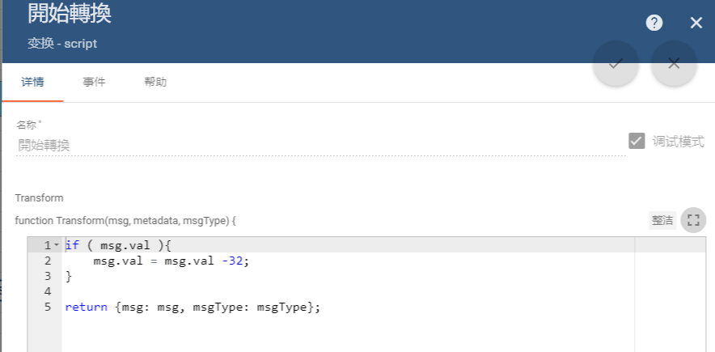

# ThingsBoard

再次對ThingsBoard的結構與常用功能進行簡單介紹和整理。


# Thingsboard的安裝

以樹莓派3B平臺的的安裝爲例，參考官方文檔的鏈接：[在Raspberry Pi 3 Model B上安装ThingsBoard](https://thingsboard.io/docs/user-guide/install/rpi/)。

按照文檔説明，簡單的配置后啓動服務，並登錄界面。


# 系統架构

ThingsBoard v2.2开始，该平台经过了重构，以支持微服务架构，而且还能够在独立模式下将其作为整体应用程序运行。

瞭解更多詳細信息：

* [__整體式__](<https://thingsboard.io/docs/reference/monolithic/>)
* [__微服務__](<https://thingsboard.io/docs/reference/msa/>)


​									(整體架構圖)


​									（微服務架構圖）


# Thingboard面板

## 規則链库

### 简述

规则引擎是用于构建基于事件的工作流的易于使用的框架。有3个主要组成部分：

- **消息** -任何传入事件。它可以是来自设备，设备生命周期事件，`REST API事件`，RPC请求等的传入数据。
- **规则节点** -对传入消息执行的功能。有许多不同的节点类型可以过滤、转换，对传入消息执行某些操作或与外部系统通信。
- **规则链** -节点之间通过关系相互连接，因此来自规则节点的出站消息将发送到下一个连接的规则节点。
- __规则节点关系__ -  标识关系的逻辑含义的标签，如“Succes”或“Failure”、“True”或“False”.

---

__`规则引擎消息`__，是可序列化的 (数据结构不变)。

表示以下系统中的各种消息:

- 来自设备的遥测, 属性更新或RPC 调用;
- 实体生命周期事件: created, updated, deleted,分配，未分配，属性更新;
- 设备状态事件: connected, disconnected, active, inactive等;
- 其他系统事件.

包含以下信息：

- __`消息ID`__: 基于时间的唯一通用标识符;
- __`消息的发起者`__: 设备Device,资产 Asset 或其他实体 [Entity](https://thingsboard.io/docs/user-guide/entities-and-relations/) 标识符;
- __`消息类型`__Type of the message: “Post telemetry” 或 “Inactivity Event”等;
  - 具体类型，详见链接：<https://thingsboard.io/docs/user-guide/rule-engine-2-0/overview/>
- 消息的__`有效负载`__：带有实际消息的JSON正文;
- __`元数据`__Metadata: 键值对列表以及其他有关消息数据.

----

租户管理员可以定义一个“ **根”规则链**，还可以定义多个其他规则链。根规则链`处理所有传入的消息`，并将其转发到其他规则链以进行其他处理。其他规则链也可以将消息转发到不同的规则链。

如"input"、"rule chain"节点。


### 节点介绍

* [__过滤节点__](<https://thingsboard.io/docs/user-guide/rule-engine-2-0/filter-nodes/>)
* [__富集节点__](<https://thingsboard.io/docs/user-guide/rule-engine-2-0/enrichment-nodes/>)
* [__转换节点__](<https://thingsboard.io/docs/user-guide/rule-engine-2-0/transformation-nodes/>)
* [__动作节点__](<https://thingsboard.io/docs/user-guide/rule-engine-2-0/action-nodes/>)
* [__外部节点__](<https://thingsboard.io/docs/user-guide/rule-engine-2-0/external-nodes/>)


### 創建模拟数据

如果需要創建模擬遙測數據，以進行相關通信的測試時，可直接通過規則鏈進行創建，而無需再使用脚本進行發送：

1. __分別打開設備管理和規則鏈管理，創建一個新的`設備`並添加或[導入](./doc/生成模擬數據.json)一個新的規則鏈：__


2. __進入規則鏈中，添加節點并進行鏈接、保存：__


3. __退至設備進行遙測數據的查看：__


---

### 数据转换

设备正使用自定义传感器收集數據并将其推送到ThingsBoard，若希望__`在保存到数据库之前，对传入遥测或属性进行数据验证和修改`__用此方法：

#### 单个设备遥测数据的处理与返回


這是一個簡單的案例，將對設備的遙測數據，在規則鏈中進行處理，並重新返回該設備，實現遙測數據的處理和更替：

1. __創建設備，並添加或[導入](./doc/數據轉換.json)規則鏈__

   

2. __進行節點的配置__

   * 添加模擬數據節點`generator`：

   * 添加數據類型轉換節點`message type switch`;

   * 添加`script`數據轉換處理節點：

   * 添加規則鏈`rule chain`至根鏈;

3. 連接節點后，保存配置，并進入創建的設備觀察遙測數據的變化：

  


#### ⭐对之前的记录进行遥测转换

具体案例：<https://thingsboard.io/docs/user-guide/rule-engine-2-0/tutorials/transform-telemetry-using-previous-record/>


#### 多个设备遥测数据的处理与关联

此案例将对多台设备的遥测数据进行关联并处理，最终返回至关联的新设备中，以提供处理数据的TOKEN接口.__`该方法可以将遥测或属性从设备复制到相关资产，以便可以汇总遥测。`__

1. 分别创建两个遥测输入设备，和一个遥测输出设备：

   

2. 为遥测输出设备添加设备关联：

   

3. 创建新的规则链：

   

4. 为了方便测试，为两个遥测输入数据设备，添加两个模拟的输入遥测数据：

   

   

   

5. 对节点依次进行配置：

   

   * 添加`switch`节点，对根链中的`设备类型`进行检测，并返回类型和数据：

   * 分别添加`script`转换节点,对两个遥测输入设备的数据类型进行转换：

     

   * 添加`change originator`变换节点，根据关联的遥测输出设备进行传输：

   * 添加`save timeseries`时间序列保存节点，将遥测输入数据输出至遥测输出设备并保存：

   * 添加`originator attributes`节点，配置输出设备的遥测属性：

   * 添加`script`输入数据转换节点：

   * 再次添加`save timeseries`时间序列节点，将处理的数据输出至设备并保存：

6. 连接节点后保存，进入根链，并添加关联节点至新创的规则链：

   

7. 返回至遥测输出设备，观察处理后的数据：

   


### 设备告警功能

能够创建和管理与您的实体（设备，资产，客户等）相关的警报。默认情况下，警报会传播到所有相关实体（仅父级关系）。

具体内容及设置案例：<https://thingsboard.io/docs/user-guide/alarms/>

### ⭐REST API调用

仅[**ThingsBoard Professional Edition**](https://thingsboard.io/products/thingsboard-pe/)支持**自定义规则引擎REST API调用**功能。

ThingsBoard提供了将自定义REST API调用发送到规则引擎，处理请求的有效负载并在响应正文中返回处理结果的API。这对于许多用例很有用。例如：

- 通过自定义API调用扩展平台的现有REST API；
- 利用设备/资产/客户的属性丰富REST API调用，并转发给外部系统以进行复杂处理；
- 为您的自定义小部件提供自定义API。

要执行REST API调用，您可以使用规则引擎控制器[REST API](https://thingsboard.io/docs/reference/rest-api/)：


注意：您在呼叫中指定的实体ID将是“规则引擎”消息的始发者。如果您未指定实体ID参数，则您的用户实体将成为消息的发起者。


### 电子邮件

发生复杂事件时发送电子邮件，并使用“电子邮件模板”中其他实体的属性。

具体案列：<https://thingsboard.io/docs/user-guide/rule-engine-2-0/tutorials/send-email/>


### ⭐RPC调用

根据定义的条件进行RPC调用。

具体案列：<https://thingsboard.io/docs/user-guide/rule-engine-2-0/tutorials/rpc-reply-tutorial/>


### 其他

- 与外部管道（如Kafka，Spark，AWS服务等）集成。


-----

### 数据分析節點

特定于ThingsBoard PE的分析节点。用于分析流数据或持久数据。

<https://thingsboard.io/docs/user-guide/rule-engine-

-----

## 用户


從上圖能看出，[社區版](https://thingsboard.io/installations/)主要包含了：`系統管理員、租戶管理員、租戶、客戶以及用戶`幾個層級。

而系統管理員、租戶、用戶的權限也各不相同。

__系統管理員：__


__租戶：__	


__用戶：__				


​								

_*ps：用戶下對應的[`实体`](https://thingsboard.io/docs/user-guide/entities-and-relations/)，包括了設備、資產、客戶以及儀表板等，而[`遥测數據`](https://thingsboard.io/docs/user-guide/telemetry/)則包括屬性、時間序列傳感讀數、統計信息和事件。_


## 设备

### 设备连接事件：

- **连接事件** -设备连接到ThingsBoard时触发。在基于会话的传输（例如MQTT）中有意义。也将为HTTP传输触发，但在这种情况下，它将在每个HTTP请求上触发；
- **断开事件** -当设备与ThingsBoard断开连接时触发。在基于会话的传输（例如MQTT）中有意义。也将为HTTP传输触发，但在这种情况下，它将在每个HTTP请求上触发；
- **活动事件** -设备推送遥测，属性更新或rpc命令时触发；
- **不活动事件** -当设备在一定时间内**不活动时**触发。请注意，即使没有从设备断开连接事件，也可能触发此事件。通常表示一段时间没有触发任何活动事件；


### 设备服务器端属性

- **active-**表示当前设备状态，为true或false；

- **lastConnectTime-**表示设备最后一次连接到ThingsBoard的时间，自1970年1月1日格林尼治标准时间00:00:00以来的毫秒数

- **lastDisconnectTime-**表示设备与ThingsBoard断开连接的最后时间，自1970年1月1日格林威治标准时间00:00:00以来的毫秒数

- **lastActivityTime-**表示设备上次推送遥测，属性更新或rpc命令的时间，自1970年1月1日格林威治标准时间00:00:00以来的毫秒数

- **inactivityAlarmTime-**表示上一次触发不活动事件的时间，自1970年1月1日格林尼治标准时间00:00:00以来的毫秒数


### Claiming Devices(设备声明)

允许ThingsBoard（TB）客户将租户的未分配设备分配给自己，而无需租户的参与。

操作方法：<https://thingsboard.io/docs/user-guide/claiming-devices/>


### CSV导入多个设备

要一次创建多个实体（资产或设备），您需要创建一个CSV文件，其中每一行将负责创建具有给定参数的一个实体。

导入方法见：<https://thingsboard.io/docs/user-guide/bulk-provisioning/>

[测试文件](./doc/EntitiesImport.csv):


特别说明:


### 遥测数据

简单的`Arduino+ESP8266`遥测传输：<https://thingsboard.io/docs/samples/arduino/temperature/>

其他开发板的软硬件连接及传输：<https://thingsboard.io/docs/samples/>

## 实体视图

`v2.2`开始，ThingsBoard的实体视图功能`EV`启用。其限制了对客户设备或资产的[遥测](https://thingsboard.io/docs/user-guide/telemetry/)和[属性](https://thingsboard.io/docs/user-guide/attributes/)的公开程度（如：允许特定的用户查看设置时段内收集的传感器读数，但**隐藏**如系统错误等调试信息。）

`每个设备或资产`可以创建`多个EV`，并分配给`不同的客户`。

具体说明：<https://thingsboard.io/docs/user-guide/entity-views/>

### 部件库

ThingsBoard安装随附的有系统级别或租户级别**Widgets捆绑包**。

系统级捆绑包可以由**系统管理员管理**，并且可供**系统中**的任何租户使用。租户级别捆绑包可以由**租户管理员管理，**并且仅可由该租户及其客户使用。

具体使用请参阅：[小部件开发指南](<https://thingsboard.io/docs/user-guide/contribution/widgets-development/>)


# 物联网网关

这是一个开放源代码解决方案，让第三方的IoT设备与Thingsboard相集合。

其功能包括：

* __MQTT扩展__：使用现有协议`连接到外部MQTT代理`的IoT设备的数据。

* __Sigfox扩展：__用于从连接到Sigfox后端的IoT设备收集数据。

* __Modbus扩展：__通过Modbus协议连接的IoT设备收集数据。
* 其他功能扩展：__<https://thingsboard.io/docs/iot-gateway/what-is-iot-gateway/>

## 安装

- [Windows](https://thingsboard.io/docs/iot-gateway/install/windows/) - install ThingsBoard IoT Gateway on Windows.
- [Linux (Ubuntu & CentOS)](https://thingsboard.io/docs/iot-gateway/install/linux/) - install ThingsBoard IoT Gateway on any pre-existing machines running Linux.
- [Raspberry Pi (Raspbian Jessie)](https://thingsboard.io/docs/iot-gateway/install/rpi/) - install ThingsBoard IoT Gateway on a Raspberry Pi.

这里依旧以树莓派为例：

1. __安装Java 8__

   IoT网关服务正在Java 8上运行。OracleJava 8已经预装在Raspbian上。您可以使用以下命令检查Java版本。任何高于或等于1.8的Java版本都可以

1. __下载安装包__

   [__安装包地址__](<https://github.com/thingsboard/thingsboard-gateway/releases/>)

   ```shell
   # Download the package
   $ wget https://github.com/thingsboard/thingsboard-gateway/releases/ download/2.2.1rc/tb-gateway-2.2.1rc.deb
   ```

1. __网关安装并作为服务__

   ```shell
   # Install gateway as a service
   $ sudo dpkg -i tb-gateway-2.2.1rc.deb
   # Update gateway memory usage and restrict it to 150MB in /etc/tb-gateway/conf/tb-gateway.conf
   export JAVA_OPTS="$JAVA_OPTS -Dplatform=rpi -Xms150M -Xmx150M"
   ```

   网关现已作为服务安装在了Raspberry上

1. __配置网关__

   导航到配置文件夹**/ etc / tb-gateway / conf**并配置与ThingsBoard服务器的连接:

   参见[__常规配置__](https://thingsboard.io/docs/iot-gateway/configuration/)。

1. __启动网关__

   ```shell
   sudo service tb-gateway start
   sudo service tb-gateway restart
   ```

1. __故障排除__

   日志文件位于**/ var / log / tb-gateway**文件夹中，**TB-gateway.log**文件应包含以下行：

   ```shell
   YYYY-MM-DD HH:mm:ss,sss [main] INFO  o.t.gateway.GatewayApplication - Started GatewayApplication in x.xxx seconds (JVM running for x.xxx)
   ```

   以发出以下命令以检查后端是否有任何错误：

   ```shell
   cat /var/log/tb-gateway/tb-gateway.log | grep ERROR
   ```

1. __网关包的升级说明__
   <https://thingsboard.io/docs/iot-gateway/install/upgrade-instructions/>

## [网关常规配置](https://thingsboard.io/docs/iot-gateway/configuration/)

## [MQTT扩展](<https://thingsboard.io/docs/iot-gateway/mqtt/>)

## [Modbus扩展](<https://thingsboard.io/docs/iot-gateway/modbus/>)

## 多租户配置

在安装并运行了Thingsboard和ThingsBoard IoT Gateway的条件下，同样可以通过**tb-gateway.yml**配置文件实现不同租户的__`共享`__

1. 创建**两个**带有用户的租户- __tenant1@thingsboard.org__和__tenant2@thingsboard.org__。

2. 以租户管理员身份登录租户1，进行网关配置：__添加设备__——__勾选"is gateway"选项__——复制设备的令牌至某处，对租户2采用相同操作；

      U2nSafTunRHOOD6A4R3u

      PCnSgODwtOrd7tMgohqs

3. __配置网关__

   进入树莓派服务器中的/etc/tb-gateway/conf路径，并配置**tb-gateway.yml**文件。该文件默认包含一个租户配置，需要在租户下添加第二个租户条目**：**

   ```yaml
   gateways:
     tenants:
       -
         label: "Tenant 1"
         reporting:
           interval: 60000
         persistence:
           type: file
           path: storage
           bufferSize: 1000
         connection:
           host: "${GATEWAY_HOST:localhost}"
           port: 1883
           retryInterval: 3000
           maxInFlight: 1000
           security:
             accessToken: "${GATEWAY_ACCESS_TOKEN_1:ACCESS_TOKEN_FOR_TENANT_1}"
         remoteConfiguration: true
       -
         label: "Tenant 2"
         reporting:
           interval: 60000
         persistence:
           type: file
           path: storage
           bufferSize: 1000
         connection:
           host: "${GATEWAY_HOST:localhost}"
           port: 1883
           retryInterval: 3000
           maxInFlight: 1000
           security:
             accessToken: "${GATEWAY_ACCESS_TOKEN_2:ACCESS_TOKEN_FOR_TENANT_2}"
         remoteConfiguration: true
   ```

4. __重启网关__

      ```
      sudo service tb-gateway restart
      ```

5. __重启并验证__

      以“ **租户1”**用户身份登录，并验证设备是否已从网关收到更新的遥测数据。**租户2**应该显示与租户一相同的内容。


# 数据庫方法

ThingsBard使用数据库存储实体和遥测数据。平台目前支持三个数据库选项：

- **SQL：**将所有实体和遥测存储在SQL数据库中。ThingsBoard作者建议使用PostgreSQL，这是ThingsBoard支持的主要SQL数据库。可以将HSQLDB用于本地开发目的。除了运行测试和启动具有最小可能负载的dev实例外，**我们不建议将HSQLDB**用于其他任何事情。
- **NoSQL：**将所有实体和遥测存储在NoSQL数据库中。ThingsBoard作者建议使用Cassandra，这是ThingsBoard目前支持的唯一NoSQL数据库。在v2.3后，將引入对AWS DynamoDB的支持。
- **混合：** 将所有实体存储在SQL数据库中，并将所有遥测存储在NoSQL数据库中。

可以使用**Thingsboard.yml**文件配置該類选项。详情请参閲数据库[__配置__](https://thingsboard.io/docs/user-guide/install/config/)页面。


<https://thingsboard.io/docs/user-guide/contribution/how-to-contribute/>


# CE与PE的主要区别

详情见：https://thingsboard.io/products/thingsboard-pe/


# REST API

## 登陆

可以使用`Swagger UI`探索ThingsBoard REST API。

```
http://192.168.3.179:8080/swagger-ui.html
```


## 验证

点击Swagger UI右上角的“`Authorization`”按钮进入“ Available authorizations”标题，并使用JWT进行请求身份验证。

`JWT令牌`需要执行以下请求：

```
curl -X POST --header 'Content-Type: application/json' --header 'Accept: application/json' -d '{"username":"tenant1@thingsboard.org", "password":"tenant"}' 'http://THINGSBOARD_URL/api/auth/login'
```

```
# 获取的值为：
{"token":"$YOUR_JWT_TOKEN", "refreshToken":"$YOUR_JWT_REFRESH_TOKEN"}
```

* 替换**$ THINGSBOARD_URL**为本地服务地址**192.168.3.179:8080**

* 将“YOUR_JWT_TOKEN”输入至Authorization进行登入
